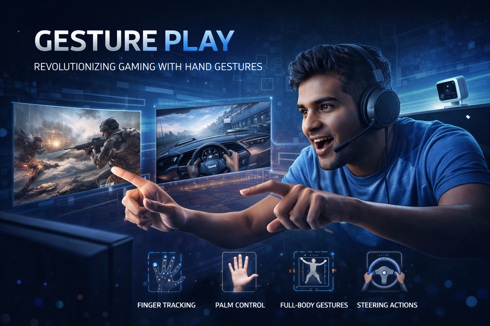

# 🎮 Gesture Play  
### Revolutionizing Gaming with Computer Vision & Machine Learning

Gesture Play is an **AI-powered gesture-based gaming control system** that enables players to interact with games using **natural human gestures** instead of traditional controllers. The system leverages **Computer Vision (CV)** and **Machine Learning (ML)** to recognize **finger, palm, full-body, and steering gestures** in real time, delivering an immersive and accessible gaming experience.

---

## 📌 Key Features

- 🖐️ **Finger Gesture Recognition**  
  Detects pointing, counting, pinching, and selection gestures

- ✋ **Palm Gesture Control**  
  Supports swipes, open/close palm actions for navigation and menu control

- 🏃 **Full-Body Gesture Tracking**  
  Recognizes jumping, running, crouching, and shooting actions

- 🕹️ **Steering Gesture Detection**  
  Simulates steering-wheel motions for racing and driving games

- ⚡ **Real-Time Performance**  
  Average latency ~ **50 ms** with > **90% accuracy**

- ♿ **Accessibility-Focused Design**  
  Enables inclusive gaming for users with physical disabilities

---

## 🔧 Technologies Used

### Software
- Python
- OpenCV
- MediaPipe
- TensorFlow / PyTorch
- Unity

### Hardware
- 1080p Webcam / Depth Camera (Kinect)
- PC with GPU (recommended)

---

---

## 🔄 Workflow

1. Capture video frame from camera  
2. Preprocess frame (resize, normalize, noise reduction)  
3. Detect landmarks using MediaPipe / OpenPose  
4. Validate gesture visibility  
5. Classify gesture using ML models  
6. Map gesture to in-game action  
7. Send command to game engine  

---

## 📊 Performance Results

| Gesture Type     | Accuracy |
|------------------|----------|
| Finger Gestures  | 95%      |
| Palm Gestures    | 93%      |
| Full Body        | 90%      |
| Steering         | 92%      |

- Mean Average Precision (mAP@0.5): 0.92  
- Average Latency: 50 ms  

---

## 🧪 Testing & Validation

- Tested with 20 users (gamers, non-gamers, users with disabilities)
- 90% reported improved immersion
- 85% found controls intuitive
- Minimal learning curve

---

## 🌍 Applications

- Gesture-based gaming
- Interactive education
- Physical rehabilitation
- Driving simulators
- Smart environments
- VR / AR interaction systems

---

## 🚀 Future Enhancements

- Adaptive gesture learning
- Voice + gesture multimodal control
- 3D gesture recognition
- Edge-device optimization
- Multi-user gesture interaction

---

## 📜 License

This project is intended for **academic and research purposes**.  
Free to use with proper attribution.

